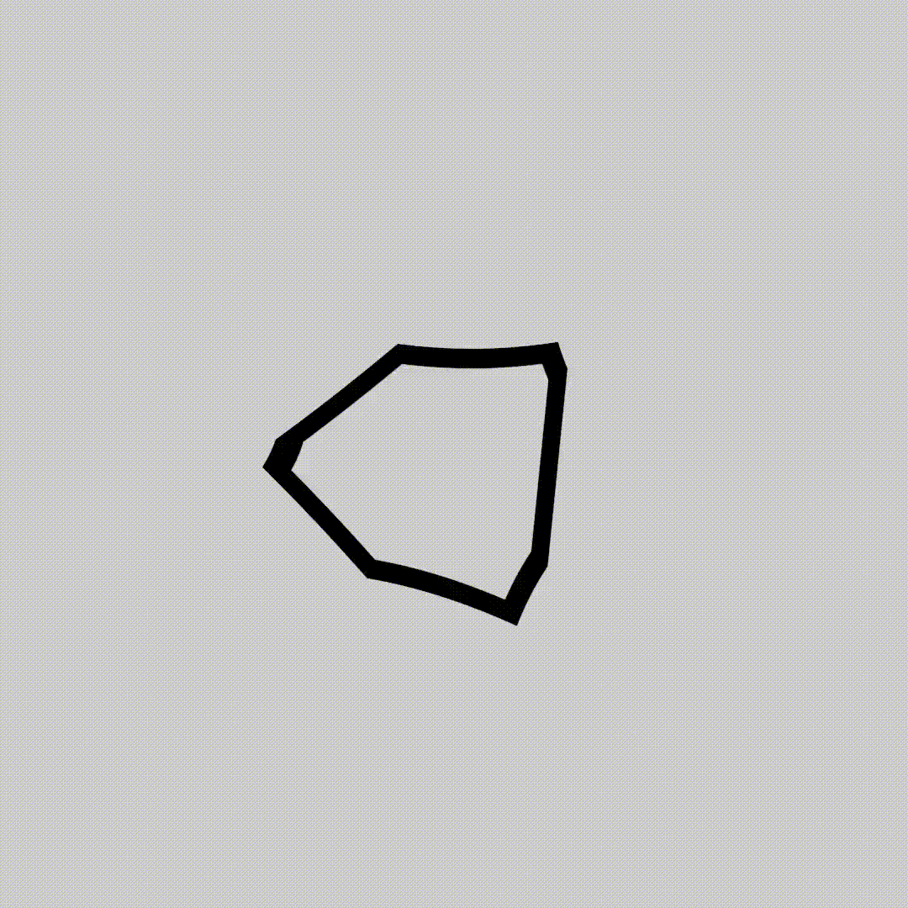
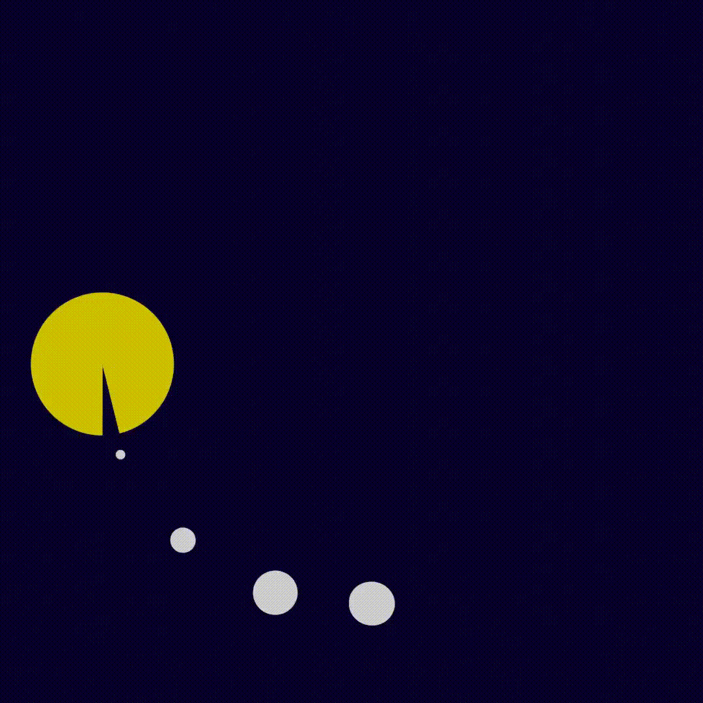
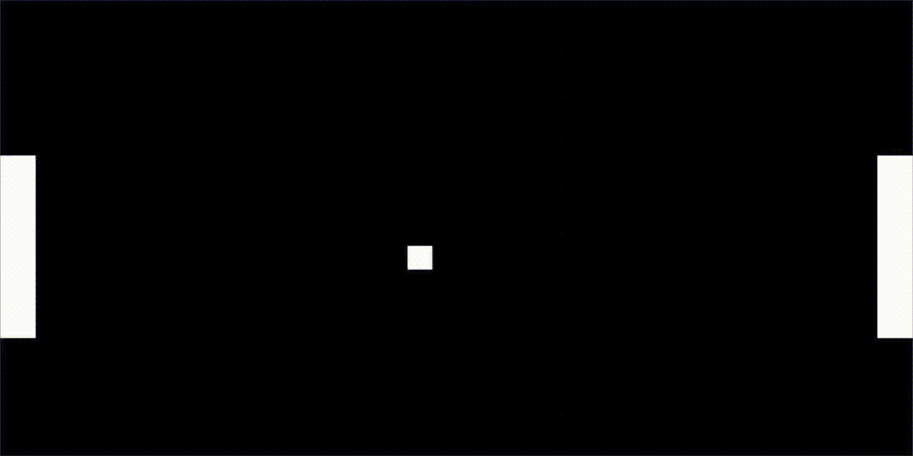

# PROcedural
Collection of random procedural stuff I made in blender

## [bar_code](https://github.com/vladantrhlik/PROcedural/tree/master/bar_code)
Generates random barcode

## [leaves](https://github.com/vladantrhlik/PROcedural/tree/master/leaves)
Recreation of random leaves I saw in one of CGMatter/Default Cube tutorials

## [n_gon](https://github.com/vladantrhlik/PROcedural/tree/master/n_gon)

'2D Metaballs' (n-gons) animation inspired by [this](https://www.youtube.com/watch?v=4JT_43qc0Dc&ab_channel=DefaultCube) video. N-gons weren't easy to make but I somehow figured it out. Metaball effect is really simple to make thanks to Smooth minimum Math node.

 

## [old_film](https://github.com/vladantrhlik/PROcedural/tree/master/old_film)
Creates oldskool border on image, simple stuff :)

## [pacman](https://github.com/vladantrhlik/PROcedural/tree/master/pacman)

Simple pacman (loading?) animation. The hardest part were points which I yoinked from [this](https://www.youtube.com/watch?v=_xfb6bUSLoM&t=308s&ab_channel=DefaultCube) video.

 

## [pong](https://github.com/vladantrhlik/PROcedural/tree/master/pong)

The hardest and the most useless thing I've ever done. Position of ball was very interesting to calculate, but annoying to recreate with nodes. It's also a bit glitchy, but it works :)

 

## [qr_code](https://github.com/vladantrhlik/PROcedural/tree/master/qr_code)
Generates random QR code (recreation of [this](https://www.youtube.com/watch?v=EYDTvC43klc&ab_channel=DefaultCube) tutorial.)

## [rain](https://github.com/vladantrhlik/PROcedural/tree/master/rain)

Simple procedurally generated rain animation

 
